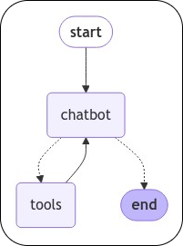
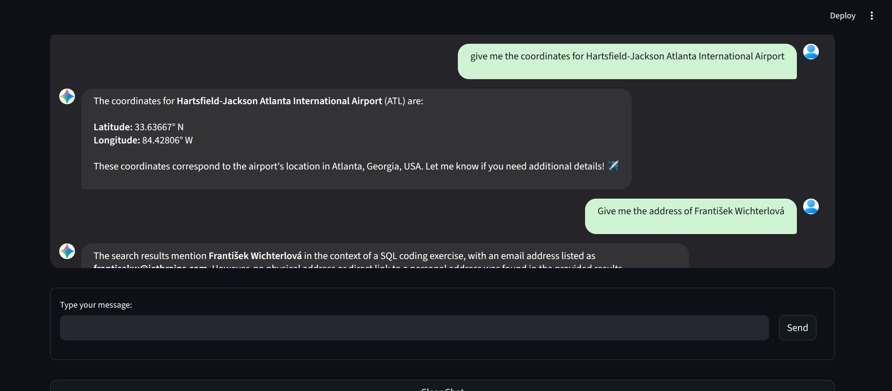
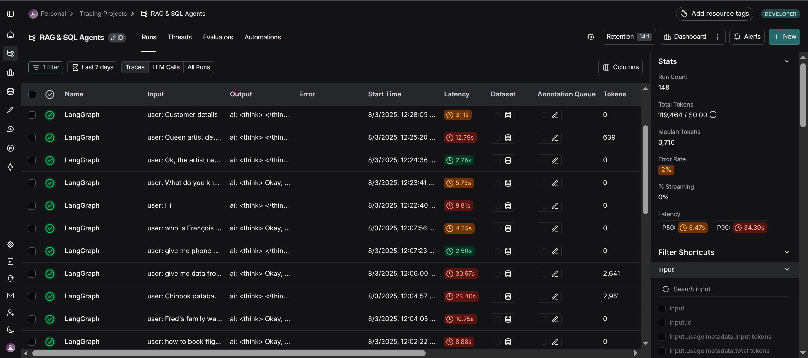

---

# Multi-Agent Chatbot with RAG and SQL Database Integration

A sophisticated conversational AI system that combines Retrieval-Augmented Generation (RAG) with SQL database agents to provide intelligent responses across multiple data sources. Built with LangGraph, LangChain, and modern LLM frameworks.

## 🏗️ Architecture Overview

### Core Agent Flow


The chatbot acts as the central orchestrator, deciding when to use external tools and how to process results before responding to users.

```
User Query → LangGraph Agent → Tool Router → [SQL Agent | RAG Tool | Search Tool] → Response
```

## 🔍 Features

### Core Capabilities
- **Multi-Modal Data Access**: Query both structured (SQL databases) and unstructured (document collections) data
- **Intelligent Agent Routing**: LangGraph-based decision making to route queries to appropriate tools
- **Conversation Memory**: Persistent chat history with daily CSV logging
- **Real-time Search**: Web search integration via Tavily API
- **Vector Database**: ChromaDB-based document retrieval system

### Supported Data Sources
- **SQL Databases**: 
  - Travel database (airline information)
  - Chinook database (music store data)
- **Document Collections**:
  - Swiss Airline policy documents
  - Story collections
- **Web Search**: Real-time information retrieval

## 💬 User Interface

### Chatbot Interface


The system provides a modern, responsive chat interface with real-time conversation capabilities, supporting both text input and file uploads.

### Key Components
- **Primary Agent**: Fireworks AI Qwen3-30B model for decision making
- **SQL Agents**: Google Gemini 2.5 Flash for database queries
- **RAG Tools**: spaCy embeddings with ChromaDB vector storage
- **Search Tool**: Tavily API for web search capabilities
- **Memory System**: Daily CSV-based conversation logging

## 📊 Monitoring and Performance

### LangSmith Dashboard


Real-time monitoring through LangSmith provides insights into:
- Agent performance metrics
- Response latency tracking
- Error rate monitoring
- Token usage optimization
- Conversation flow analysis

## 📚 Prerequisites

### System Requirements
- **OS**: Linux (tested on Ubuntu 6.14.0-24-generic) or Windows
- **Python**: 3.9+ (tested with Python 3.12)
- **Memory**: Minimum 8GB RAM (16GB recommended for large databases)

### API Keys Required
- **Fireworks AI**: For Qwen3-30B model access
- **Google AI**: For Gemini 2.5 Flash model
- **Tavily**: For web search functionality
- **LangChain**: For LangSmith monitoring (optional)

## 🛠️ Installation

### 1. Clone and Setup
```bash
git clone <your-repository-url>
cd Multi-Agent-Chatbot-with-RAG-and-SQL-Database
python -m venv venv
source venv/bin/activate  # On Windows: venv\Scripts\activate
```

### 2. Install Dependencies
```bash
pip install -r requirements.txt
```

### 3. Environment Configuration
```bash
cp env_example .env
# Edit .env with your API keys:
# FIREWORKS_API_KEY=your_key_here
# GOOGLE_API_KEY=your_key_here
# TAVILY_API_KEY=your_key_here
# LANGCHAIN_API_KEY=your_key_here
```

### 4. Download Required Data

Download databases to data/ folder:
- [travel.sqlite](https://storage.googleapis.com/benchmarks-artifacts/travel-db/travel2.sqlite) (109MB)
- [Chinook.db](https://drive.google.com/file/d/1HH0NdFCiVc4Moge5Rmx2ri_gXNhfQyTZ/view?usp=sharing) (984KB)
- Add your documents to `data/unstructured_docs/`


### 5. Prepare Vector Databases
```bash
python src/prepare_vector_db.py
```

## 🔧 Usage

### Streamlit Interface
```bash
streamlit run src/app.py
```

## 📁 Project Structure
```
Multi-Agent-Chatbot-with-RAG-and-SQL-Database/
├── configs/ # Configuration files
│ ├── tools_config.yml # Tool-specific settings
│ └── project_config.yml # Global project settings
├── src/ # Main application code
│ ├── agent_graph/ # LangGraph agent implementation
│ │ ├── build_full_graph.py
│ │ ├── tool_*.py # Individual tool implementations
│ │ └── load_tools_config.py
│ ├── chatbot/ # Chatbot backend
│ │ ├── chatbot_backend.py
│ │ ├── memory.py # Conversation persistence
│ │ └── load_config.py
│ ├── ui/ # Streamlit UI components
│ ├── utils/ # Utility functions
│ ├── app.py # Streamlit application
│ └── prepare_vector_db.py # Vector database setup
├── data/ # Data storage
│ ├── travel.sqlite # Travel database
│ ├── Chinook.db # Music database
│ ├── unstructured_docs/ # Document collections
│ └── _vectordb/ # Vector databases
├── memory/ # Conversation logs (CSV files)
├── Notebooks/ # Development and exploration notebooks
└── images/ # Documentation images
```

## 💬 Sample Queries

### Database Queries
- "Give me the table names in travel database"
- "Is there any flight available from CDG to BSL?"
- "List the total sales per country in chinook database"
- "What are all the genres of Alanis Morisette songs?"

### Document Queries
- "In the stories, who is lily?"
- "Based on the airline policy, do I need to reconfirm my flight?"
- "Can I cancel my ticket 10 hours before the flight?"

### Web Search
- "Give me the link of wildlens by abrar latest video on youtube"
- "What are some websites for google public datasets?"

## 🔍 Monitoring and Debugging

### LangSmith Integration
The system includes LangSmith tracing for monitoring agent performance and debugging:
- Project name: "rag_sqlagent_project"
- Thread-based conversation tracking
- Tool execution monitoring

### Memory System
- Daily CSV logs in `memory/` directory
- Thread-based conversation tracking
- Timestamp and query-response pairs

## 🐛 Troubleshooting

### Common Issues

#### Fireworks AI Proto File Conflict
If you encounter the error `Couldn't build proto file into descriptor pool: duplicate file name google/longrunning/operations.proto`, run:
```bash
rm -rf venv/lib/python3.12/site-packages/fireworks/control_plane/generated/protos_grpcio/google/longrunning
ln -s venv/lib/python3.12/site-packages/google/longrunning \
      venv/lib/python3.12/site-packages/fireworks/control_plane/generated/protos_grpcio/google/longrunning
```

#### Vector Database Issues
- Ensure spaCy model is installed: `python -m spacy download en_core_web_lg`
- Check document paths in configuration
- Verify ChromaDB permissions

#### API Key Issues
- Verify all API keys are correctly set in `.env`
- Check API quotas and billing status
- Ensure proper API key permissions

## 📈 Adding Custom Data Sources

### New SQL Database
1. Add database file to `data/` directory
2. Create new tool in `src/agent_graph/tool_*.py`
3. Update `tools_config.yml` with database configuration
4. Register tool in `build_full_graph.py`

### New Document Collection
1. Add documents to `data/unstructured_docs/`
2. Update RAG configuration in `tools_config.yml`
3. Run `prepare_vector_db.py` to create embeddings
4. Create new RAG tool and register in graph

## 📊 Performance Considerations

- **Large Databases**: Use appropriate chunking strategies for document processing
- **Memory Usage**: Monitor RAM usage with large vector databases
- **API Costs**: Consider rate limiting and caching for external API calls
- **Response Time**: Optimize embedding models and retrieval parameters

## 🤝 Contributing

1. Fork the repository
2. Create a feature branch
3. Make your changes
4. Add tests if applicable
5. Submit a pull request

## 👏 Acknowledgments

- LangChain and LangGraph communities
- Fireworks AI for model access
- Google AI for Gemini models
- Tavily for search capabilities

---

**Note**: This project demonstrates advanced LLM agent architectures and should be used as a reference for building similar systems. Ensure compliance with data privacy regulations when deploying with sensitive data.